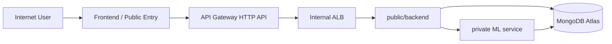

# CloudFormation Design Guide for Cloud Service

This document describes a CloudFormation-friendly deployment model for `cloud_service` only.

- `cloud_service/public/backend` is the public Node.js gateway.
- `cloud_service/private` is the private biometric ML service.
- `client` and `apiContainer` are intentionally excluded.

## Goal

Provision a secure, separable AWS network with:

- A public path for the external entry point and public gateway.
- A private path for the biometric ML service.
- External MongoDB Atlas connectivity.
- Clear security group boundaries.
- Support for future frontend hosting in the public tier.

## Recommended AWS Components

### Networking

- One VPC.
- Two public subnets across at least two AZs.
- Two private subnets across at least two AZs.
- Internet Gateway attached to the VPC.
- NAT Gateway in a public subnet if private instances need outbound internet.

### Compute

- `public/backend`: ECS Service, EC2 instance, or App Runner behind an ALB.
- `private`: EC2 instance, ECS service, or equivalent internal service in private subnets.

### Edge / Entry

Choose one of these entry patterns:

1. Application Load Balancer in front of `public/backend`.
2. API Gateway HTTP API in front of an ALB using VPC Link.

If you want a clean separation and future expansion, prefer:

- API Gateway -> VPC Link -> internal ALB -> `public/backend`

### Storage and Secrets

- AWS Secrets Manager for `MONGO_URI`, Google secrets, JWT PEM material, and `BIOMETRIC_SECRET_KEY`.
- AWS Systems Manager Parameter Store for non-secret configuration.
- CloudWatch Logs for application logs.

## Proposed Traffic Flow



## VPC Layout

### Public subnets

Use public subnets for:

- ALB
- API Gateway integration target if required
- Optional public frontend hosting assets

### Private subnets

Use private subnets for:

- `cloud_service/private`
- Databases or internal-only support services

### Security Groups

Suggested rules:

- `sg-alb-public`
  - Inbound: `443` from `0.0.0.0/0`
  - Outbound: to `sg-public-backend`
- `sg-public-backend`
  - Inbound: application port from `sg-alb-public`
  - Outbound: `9000` to `sg-private-ml`, `443` to internet for Google/Atlas/SMTP
- `sg-private-ml`
  - Inbound: `9000` only from `sg-public-backend`
  - Outbound: `443` to internet for Atlas if needed

## Environment Variables by Stack

### Public backend stack

```env
MONGO_URI=<atlas-uri>
MONGO_DB_NAME=mfa_biometric
GOOGLE_CLIENT_ID=<google-client-id>
GOOGLE_CLIENT_SECRET=<google-client-secret>
GOOGLE_REDIRECT_URI=https://<domain>/api/auth/callback/google
GOOGLE_JWKS_URI=https://www.googleapis.com/oauth2/v3/certs
JWT_PUBLIC_KEY_PATH=./keys/jwt_public.pem
JWT_PRIVATE_KEY_PATH=./keys/jwt_private.pem
JWT_ALGO=RS256
JWT_EXPIRATION_SECONDS=3600
SDK_URL=http://<private-internal-dns>:9000
PRIVATE_LSTM_URL=http://<private-internal-dns>:9000
ML_SERVICE_USERNAME=bmfa_user
ML_SERVICE_PASSWORD=<strong-password>
BIOMETRIC_SECRET_KEY=<hex-64>
PORT=4003
```

### Private ML stack

```env
API_HOST=0.0.0.0
API_PORT=9000
ML_SERVICE_USERNAME=bmfa_user
ML_SERVICE_PASSWORD=<strong-password>
TLS_ENABLED=false
MODEL_PATH=./src/app/Entrenamineto_LSTM/embedding_network_mini.h5
MONGO_URI=<atlas-uri>
MONGO_DB_NAME=mfa_biometric
ENVIRONMENT=production
DEBUG=false
```

## MongoDB Atlas Connectivity

CloudFormation should not embed raw secrets in template parameters if you can avoid it.

Recommended pattern:

1. Store the Atlas connection string in Secrets Manager.
2. Inject it into `public/backend` and `private` as an environment variable at launch.
3. Allow the AWS outbound IP or NAT path in Atlas Network Access.

Example connection string shape:

```env
mongodb+srv://<user>:<password>@<cluster>/<db>?retryWrites=true&w=majority&appName=<app>
```

Important:

- Use a dedicated Atlas user with only the required database privileges.
- Prefer TLS at the Atlas side as already shown in your `.env` files.
- Do not commit the URI into CloudFormation source control; reference Secrets Manager instead.

## CloudFormation Resource Outline

### Networking resources

- `AWS::EC2::VPC`
- `AWS::EC2::Subnet` for public and private subnets
- `AWS::EC2::InternetGateway`
- `AWS::EC2::VPCGatewayAttachment`
- `AWS::EC2::RouteTable` and routes
- `AWS::EC2::NatGateway` if private subnets need internet egress

### Load balancing and edge

- `AWS::ElasticLoadBalancingV2::LoadBalancer`
- `AWS::ElasticLoadBalancingV2::Listener`
- `AWS::ElasticLoadBalancingV2::TargetGroup`
- Optional `AWS::ApiGatewayV2::Api`
- Optional `AWS::ApiGatewayV2::VpcLink`

### Compute

- `AWS::ECS::Cluster`
- `AWS::ECS::TaskDefinition`
- `AWS::ECS::Service`

or, for a simpler first deployment:

- `AWS::EC2::Instance` for each service
- `AWS::IAM::InstanceProfile`
- `AWS::SSM::Association` or user data bootstrap

### Secrets and config

- `AWS::SecretsManager::Secret`
- `AWS::SSM::Parameter`
- `AWS::IAM::Role` for runtime access

## Suggested Parameter Set

CloudFormation parameters you will likely want:

- `EnvironmentName`
- `VpcCidr`
- `PublicSubnetCidrs`
- `PrivateSubnetCidrs`
- `PublicBackendImage` or artifact location
- `PrivateMlImage` or artifact location
- `MongoUriSecretArn`
- `GoogleClientId`
- `GoogleClientSecretArn`
- `JwtPublicKeySsmParam`
- `JwtPrivateKeySsmParam`
- `BiometricSecretKeySecretArn`

## Bootstrap Sequence

1. Create VPC, subnets, routing, and security groups.
2. Create Secrets Manager entries.
3. Deploy private ML service into private subnets.
4. Deploy public backend into public subnets or behind an internal ALB.
5. Configure API Gateway or ALB as the public entry.
6. Attach DNS in Route 53 if needed.

## Operational Notes

- `public/backend` should be the only service that signs and verifies the server JWT.
- `private` should only validate biometrics and Basic Auth.
- The frontend should only talk to the public backend and never to the private service directly.
- `client/backend` and `apiContainer` remain outside this stack by design.

## Minimal Template Structure

```yaml
Parameters:
  EnvironmentName:
    Type: String
  MongoUriSecretArn:
    Type: String

Resources:
  Vpc:
    Type: AWS::EC2::VPC
  PublicSubnetA:
    Type: AWS::EC2::Subnet
  PrivateSubnetA:
    Type: AWS::EC2::Subnet
  Alb:
    Type: AWS::ElasticLoadBalancingV2::LoadBalancer
  PublicBackendService:
    Type: AWS::ECS::Service
  PrivateMlService:
    Type: AWS::ECS::Service
```

## What This Guide Does Not Cover

- `client/backend`
- `apiContainer`
- Flutter deployment

Those are deployed separately.
